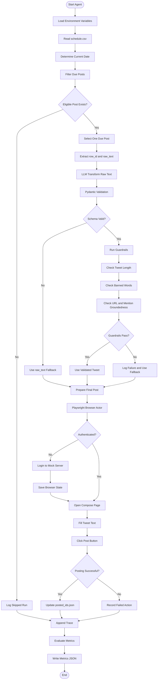

# Guardrailed X (Twitter) Posting Agent Harness

This project implements a robust, guardrailed agent for posting to a mock social media platform, designed for automated evaluation and deterministic behavior. It leverages Playwright for browser automation, Pydantic for strict data validation, and a deterministic control loop to ensure safe and controlled interactions.

## Project Purpose

The primary goal is to demonstrate a secure and reliable agent that can post content to a social media platform (mocked as "X" or "Twitter") while adhering to strict safety and content guidelines. The agent is designed to prevent unsafe or unvalidated LLM output from reaching the platform, ensuring all posts are compliant with predefined rules.

## Architecture

The agent follows a deterministic control loop with several key stages:

1.  **Deterministic Control Loop:** Reads a schedule, identifies due posts, and selects exactly one post per day. The LLM never decides which row is due or if it was already posted.
2.  **LLM Transformation:** A Large Language Model (LLM) processes the raw text from the schedule, transforming it into a tweet. The LLM's output is strictly validated using Pydantic.
3.  **Pydantic Validation:** Ensures the LLM's output conforms to a predefined schema, including `tweet_text` and `source_row_id`.
4.  **Deterministic Guardrails:** A `GuardrailChain` applies a series of checks (length, banned words, groundedness) to the LLM's output. If any guardrail fails, the agent logs the failure and falls back to the original `raw_text`.
5.  **Playwright Execution:** A Playwright browser actor logs into the mock social server (if not already authenticated), navigates to the compose page, fills the tweet text, and posts it. Browser state is persisted.
6.  **JSONL Observability:** Every attempted processing run appends a detailed JSON object to `data/traces.jsonl`, providing a complete, replayable record of the agent's actions and decisions.
## Architecture Diagram


## Repository Structure

```
project/
├── README.md
├── docker-compose.yml
├── Dockerfile
├── .env.example
├── evaluate.py
├── src/
│   ├── __init__.py
│   ├── agent.py             # Main agent logic
│   ├── browser_actor.py     # Playwright automation
│   ├── guardrails.py        # Deterministic guardrail implementation
│   ├── llm_service.py       # LLM wrapper and interaction
│   ├── mock_social_server.py# FastAPI mock social server
│   ├── models.py            # Pydantic data models
│   └── utils.py             # Utility functions (e.g., date handling)
├── tests/
│   ├── __init__.py
│   ├── test_agent.py
│   ├── test_browser_actor.py
│   ├── test_guardrails.py
│   ├── test_llm_service.py
│   └── test_mock_social_server.py
├── data/
│   ├── schedule.csv         # Schedule of posts
│   ├── posted_ids.json      # Records of already posted row IDs
│   ├── browser_state.json   # Playwright browser storage state
│   └── traces.jsonl         # Observability traces
└── results/
    └── metrics.json         # Evaluation metrics
```

## Setup

1.  **Prerequisites:**
    *   Docker and Docker Compose installed.
    *   Python 3.9+ (for local development/testing, though Docker is preferred).

2.  **Environment Variables:**
    Create a `.env` file in the project root based on `.env.example` and fill in the placeholder values.

    ```bash
    cp .env.example .env
    ```

    Example `.env` content:
    ```
    LLM_BASE_URL="http://mock-llm:8000/v1" # Or your actual LLM endpoint
    OPENAI_API_KEY="sk-your-openai-key" # Required by OpenAI client, even if using mock
    MOCK_SOCIAL_URL="http://mock_social:8080"
    MOCK_USERNAME="testuser"
    MOCK_PASSWORD="testpassword"
    HITL_ENABLED="false" # Set to "true" to enable Human-in-the-Loop approval
    ```

3.  **Data Initialization:**
    Ensure the `data` directory exists and contains the initial files.
    `schedule.csv` must be present. `posted_ids.json`, `browser_state.json`, and `traces.jsonl` will be created/updated by the agent.

    Example `data/schedule.csv`:
    ```csv
    row_id,post_date,raw_text
    1,2024-01-01,Hello world! This is my first post.
    2,2024-01-02,Excited to share some news today.
    3,2024-01-03,Remember to always learn something new.
    4,2024-01-04,This is a test post for groundedness check. Visit example.com
    5,2024-01-05,I guarantee you will love this investment opportunity.
    ```

## Environment Variables

*   `LLM_BASE_URL`: The base URL for the LLM API. This can point to a local mock LLM or a remote service.
*   `OPENAI_API_KEY`: API key for OpenAI. Required by the OpenAI client, even if `LLM_BASE_URL` points to a mock.
*   `MOCK_SOCIAL_URL`: The URL of the mock social server. Inside Docker, this will be `http://mock_social:8080`.
*   `MOCK_USERNAME`: Username for logging into the mock social server.
*   `MOCK_PASSWORD`: Password for logging into the mock social server.
*   `HITL_ENABLED`: Set to `"true"` to enable Human-in-the-Loop approval, `"false"` otherwise.

## Docker Commands

To build and run the entire project (agent and mock social server):

```bash
docker-compose up --build
```

To run the agent once (e.g., for testing or manual execution outside the continuous loop):

```bash
docker-compose run --rm agent python src/agent.py
```

To run tests:

```bash
docker-compose run --rm agent pytest tests/
```

To run evaluation:

```bash
docker-compose run --rm agent python evaluate.py
```

## How to Run the Agent

The agent is designed to run as a Docker service. When you execute `docker-compose up --build`, both the `mock_social` server and the `agent` service will start. The `agent` service will automatically execute `src/agent.py` which contains the main logic.

The agent will:
1.  Load environment variables.
2.  Read `data/schedule.csv`.
3.  Determine the current date (timezone-aware).
4.  Filter for due posts, ensuring only one is processed per day and previously posted IDs are ignored.
5.  Call the LLM service to transform the `raw_text`.
6.  Apply guardrails to the LLM output.
7.  If guardrails pass, post the LLM output; otherwise, fall back to `raw_text`.
8.  Use Playwright to interact with the `mock_social` server.
9.  Record a trace of the entire process in `data/traces.jsonl`.

## How the Mock Social Server Works

The `mock_social_server.py` is a FastAPI application that simulates a basic social media platform.

*   **`/login`**: Provides a simple login page with `#username`, `#password`, and `#login-btn` selectors. It accepts any username/password and sets a session cookie upon successful login.
*   **`/compose/tweet`**: Provides a tweet composition page with `#tweet-text` and `#post-btn` selectors. It accepts a tweet and simulates a successful post.
*   **Deterministic Behavior**: The server's behavior is entirely deterministic, making it suitable for automated testing and evaluation.

## Guardrails

The `GuardrailChain` ensures that LLM outputs are safe and compliant before being posted. It includes:

1.  **Length Check:** Rejects tweets longer than 280 characters.
2.  **Banned Words:** Rejects tweets containing "guarantee" or "investment" (case-insensitive).
3.  **Groundedness:** Rejects URLs or `@mentions` introduced by the LLM that were not present in the original `raw_text`. This prevents the LLM from hallucinating external references.

### Fallback Behavior

If *any* guardrail fails, the agent does not crash. Instead:
1.  It logs the specific guardrail failure reason.
2.  It falls back to using the original `raw_text` from the `schedule.csv` for posting.
3.  The `final_posted_text` in the trace will reflect this fallback.

This ensures that content is always posted, but only safe and validated content from the LLM, or the original, un-transformed text if the LLM's output is deemed unsafe.

## Playwright Authentication State

The Playwright browser actor manages its authentication state:

*   It attempts to load a saved browser storage state from `data/browser_state.json`.
*   If `browser_state.json` exists, it skips the login process and directly navigates to the `/compose/tweet` page.
*   If `browser_state.json` does not exist, it performs a login to `/login` using `MOCK_USERNAME` and `MOCK_PASSWORD`, then saves the storage state to `data/browser_state.json` for future runs.
*   The agent will fail loudly if required selectors are unavailable or if authentication fails. It will never proceed unauthenticated.

## Traces

Every attempted processing run appends a JSON object to `data/traces.jsonl`. This file serves as a comprehensive log for observability and debugging. Each trace contains:

*   `timestamp`: When the run occurred.
*   `row_id`: The ID of the schedule row processed.
*   `raw_text`: The original text from `schedule.csv`.
*   `llm_text`: The text generated by the LLM.
*   `guardrail_passed`: Boolean indicating if all guardrails passed.
*   `guardrail_failure_reason`: A string describing the failure, if any.
*   `final_posted_text`: The text actually sent to the mock social server (either `llm_text` or `raw_text` fallback).
*   `action_status`: "success", "skipped", or "failed".

### Example Trace

```json
{"timestamp": "2024-01-01T12:00:00Z", "row_id": "1", "raw_text": "Hello world!", "llm_text": "Hello world from LLM!", "guardrail_passed": true, "guardrail_failure_reason": null, "final_posted_text": "Hello world from LLM!", "action_status": "success"}
{"timestamp": "2024-01-02T12:00:00Z", "row_id": "2", "raw_text": "This is an investment opportunity.", "llm_text": "Check out this amazing investment!", "guardrail_passed": false, "guardrail_failure_reason": "Banned word 'investment' detected.", "final_posted_text": "This is an investment opportunity.", "action_status": "success"}
```

## Evaluation Metrics

The `evaluate.py` script reads `data/traces.jsonl` and calculates the following metrics, writing them to `results/metrics.json`:

*   **`task_completion_rate`**: The proportion of successfully posted items (where `action_status` is "success") out of all attempted posts.
*   **`groundedness_score`**: The proportion of posts where the LLM did not introduce new URLs or @mentions compared to the `raw_text`. This is calculated based on `guardrail_passed` and `guardrail_failure_reason` for groundedness.
*   **`guardrail_trigger_rate`**: The proportion of posts where at least one guardrail was triggered (i.e., `guardrail_passed` is `false`).

All values are floats between 0.0 and 1.0. The calculation is deterministic and compatible with injected evaluator traces.

## Tests

Automated tests are located in the `tests/` directory and cover all core requirements:

*   Date filtering logic.
*   Duplicate post prevention.
*   Handling of multiple due rows.
*   Pydantic validation of LLM output.
*   Guardrail rejections (>280 characters, banned words, groundedness).
*   Raw-text fallback mechanism.
*   Playwright/mock server interaction.
*   Saved browser state functionality.
*   Trace schema adherence.
*   Evaluation metric calculations.

To run tests: `docker-compose run --rm agent pytest tests/`

## Security Considerations

*   **No Live X/Twitter:** The agent is strictly designed to interact with a local mock social server. It should *never* be configured to interact with a live social media platform.
*   **Environment Variables:** Sensitive information (API keys, passwords) is managed via environment variables and `.env` files, which should be excluded from version control.
*   **Guardrails:** The deterministic guardrails are critical for preventing malicious or inappropriate LLM output from being posted. They act as a crucial safety layer.
*   **Deterministic Behavior:** The deterministic nature of the agent and mock server aids in auditing and ensuring predictable behavior, reducing the risk of unexpected actions.
